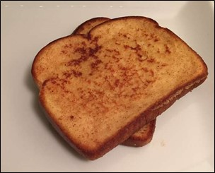

# How to make: Vegan French Toast

Adapted from Xena Moroni.  
Total cook and prep time: 20 minutes  
Makes 2 Servings

## Ingredients

- 1 cup soy milk
- 2 tablespoons all-purpose flour
- 1 teaspoon turbinado (or optionally brown) sugar
- 1 teaspoon vanilla extract
- ¼ teaspoon ground cinnamon
- 2 teaspoons canola oil
- 4 slices of bread
- (Optional: Maple syrup or sugar syrup)

## Tools

- Whisk
- Non-rubber Spatula
- Medium bowl
- Rimmed plate or shallow dish
- Large skillet

## Directions

1. Whisk the soy milk, flour, sugar, vanilla extract, and cinnamon together in a bowl.
1. Transfer the soy milk mixture into the plate or dish.
1. Lightly coat the skillet with the canola oil.
1. Heat the skillet over medium-low heat.
1. Dip both sides of each bread slice in the soy milk mixture.
1. Cook each slice of bread for 3 to 4 minutes per side, until golden brown (figure 3).
1. Serve!
1. (Optional) Add syrup.

Results

You should have 4 delicious, golden brown slices of French toast. See
figure 3.

##### Figure 3.
